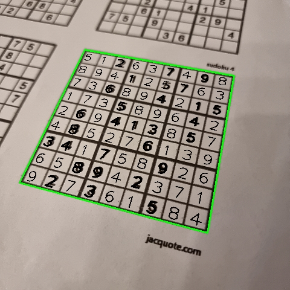
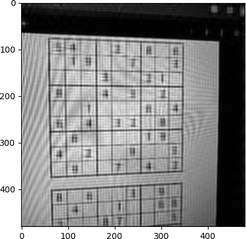

# AR Sudoku Solver

This project is a Sudoku solver application for Android in augmented reality (AR).  
It uses OpenCV for all image processing.

## How to build

Clone this repo and add in the ARSudokuSolver a `gradle.properties` file.  
There should be in this file the following values :  
```
sdk.dir=/path/to/Android/Sdk
signings.store.path=/path/to/keystore/file.jks
signings.store.password=keystore_password
signings.key.alias=key_name
signings.key.password=key_password
```  
Then you should be able to open the folder containing this file in Android Studio


## Pipeline

### Step 1

I use the camera to get the picture.  


### Step 2

I use the adaptativeThreshold function to highlight the contours.  


### Step 3

I use the findContours function to find the maximum quadrilateral area of the picture. Then I show the grid in the image.  


### Step 4

I use the getPerspectiveTransform function to find the transformation to get a square from the quadrilateral. The I use the warpPerspectiveFunction to apply the transformation on the thresholded image.  


### Step 5

I divide the image into 81 images for each cell of the grid, here are some exemples :  


  

I use a neural network to deduce the numbers of each cell (or 0 if there is no number). Then I use an algorithm (explained after) to solve the sudoku. Finally, I write each values to the square image.  


### Step 6

I use the transformation from the square to the quadrilateral made of the contours of the detected grid to project the numbers at the place of the grid.  


### Step 7

Finally I substract the image with the numbers to the original photo to make appear the numbers in black.  


## Sudoku Resolution

To solve the sudoku, I repeat the following steps until the end.
- I find all possible values for each empty cell
- If a cell has only one possible value
	- I affect that value to the cell
- If no value was affected
	- I choose one cell with the least number of possible values
	- I choose one of the possible value and affect it, and save that choice
- If there is an error
	- Remove all values affected since the last saved choice
	- Remove that choice of the possible values

## Neural Network

About this, I'm still working on it because I have some problems when filming a screen because of the Moiré pattern that appears on the picture.  
I don't know yet how to generate the Moiré pettern noise nor how to remove it from picture.

### Generate the Moiré pattern noise

I tried to generate the noise using thresholded Perlin noise with different parameters, following picture give the result I have.  

I want to use this noise to improve the dataset, but for now it doesn't work.

### Remove the Moiré pattern noise

I tried to remove this pattern directly from the original picture.  
It appears that method like blocking some frequencies using the Fourier transform doesn't work as well as expected, the following pictures show some results.
- input image  


- Fourier transform result  


- band stop filter  


- band stop result  


- cut filter  


- cut result  

