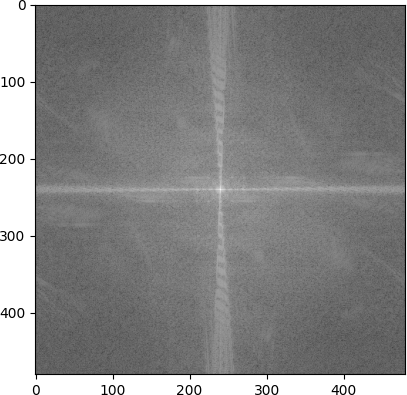

# AR Sudoku Solver

This project is a Sudoku solver application for Android in augmented reality (AR).  
It uses OpenCV for all image processing.  
To do so, the app scans a grid of Sudoku using the camera. When a grid is detected (explained how in the pipeline), the user can ask to solve it. The sudoku is then solved once and it stays solved and displayed while the same sudoku is detected (computed each frame). When a new sudoku is detected, the user has to ask again to solve the sudoku. Doing this way allows this app to run easily at 30 fps on a mobile phone.

## How to build

Clone this repo and add a `local.properties` file at the root folder of the Android app:  
```bash
git clone https://github.com/borisbordeaux/ARSudokuSolver.git
cd ARSudokuSolver/ARSudokuSolver
printf "sdk.dir=/path/to/Android/Sdk\n" > local.properties
printf "signings.store.path=/path/to/keystore/file.jks\n" >> local.properties
printf "signings.store.password=keystore_password\n" >> local.properties
printf "signings.key.alias=key_name\n" >> local.properties
printf "signings.key.password=key_password\n" >> local.properties
```
You should create a store and a key to sign the app in release mode.
Then you should be able to open the folder containing this file in Android Studio.

## Pipeline

### Step 1

I use the camera to get the picture.  


### Step 2

I use the adaptiveThreshold function to highlight the contours.  


### Step 3

I use the findContours function to find the maximum quadrilateral area of the picture. Then I show the grid in the image. It is not really necessary but good for users to see when they can solve the sudoku.  


### Step 4

I use the getPerspectiveTransform function to find the transformation to get a square from the quadrilateral. Then use the warpPerspectiveFunction to apply the transformation on the thresholded image.  


### Step 5

I divide the grid into 81 images for each cell, following pictures are some examples.  
Then I use a neural network to deduce the number in each cell (0 if there is no number).  


  

### Step 6

I use an algorithm (explained after) to solve the sudoku. Then, I write each value in white to a black square image.  


### Step 7

I use the transformation from the square to the quadrilateral representing the contours of the detected grid to project the numbers at the place of the grid.  


### Step 8

Finally I substract the image with the numbers to the original photo to make appear the numbers in black.  


## Sudoku Resolution

To solve the sudoku, I repeat the following steps until there are no more possibilities:  
- Find all possible values for each empty cell
- If a cell has only one possible value
	- Affect that value to the cell
- If no value was affected
	- Choose one cell with the least number of possible values
	- Choose one of the possible value and affect it, and I save that choice
- If there is an error
	- Remove all values affected since the last saved choice
	- Remove that choice of the possible values for the cell

At the end of that loop, if there is no error, the sudoku is solved. If there are errors, the sudoku is not solvable (it happens only if there was an error with the input sudoku).

## Neural Network

About the neural network, I am still working on it. I have some problems when filming a screen because of the Moiré pattern that appears on the picture.  
During the threshold operation, it makes appear a lot of noise hence it is difficult for the AI to find the right number in the cell. The following pictures show some cells obtained after threshold when there is Moiré noise :  


  
I see that the number is still visible because it is surrounded by a black band, then it should be possible for the AI to classify the number. However when there is no number, the pattern makes currently the AI classifications false.
I have then 2 possibilities:  
- Generate noisy images with Moiré pattern noise to denoise using another neural network
- Denoise the Moiré pattern before using the neural network

### Generate the Moiré pattern noise

I tried to generate the noise using thresholded Perlin noise with different parameters, following picture gives the result I have.  
  
I want to use this noise to improve the dataset, but for now it does not give good enough results. I should retry with bigger images, maybe 64x64 instead of 28x28 or even bigger depending on the performance I have when using a phone.

### Remove the Moiré pattern noise

I tried to remove this pattern directly from the original picture.  
It appears that method like blocking some frequencies using the Fourier transform does not work as well as expected, the following pictures show some results. I think it is because the noise frequency is not that much different of the sudoku grid and numbers frequency.

- Input image  


- Fourier transform result  


- Band stop filter  


- Band stop result  


- Cut filter  


- Cut result  

